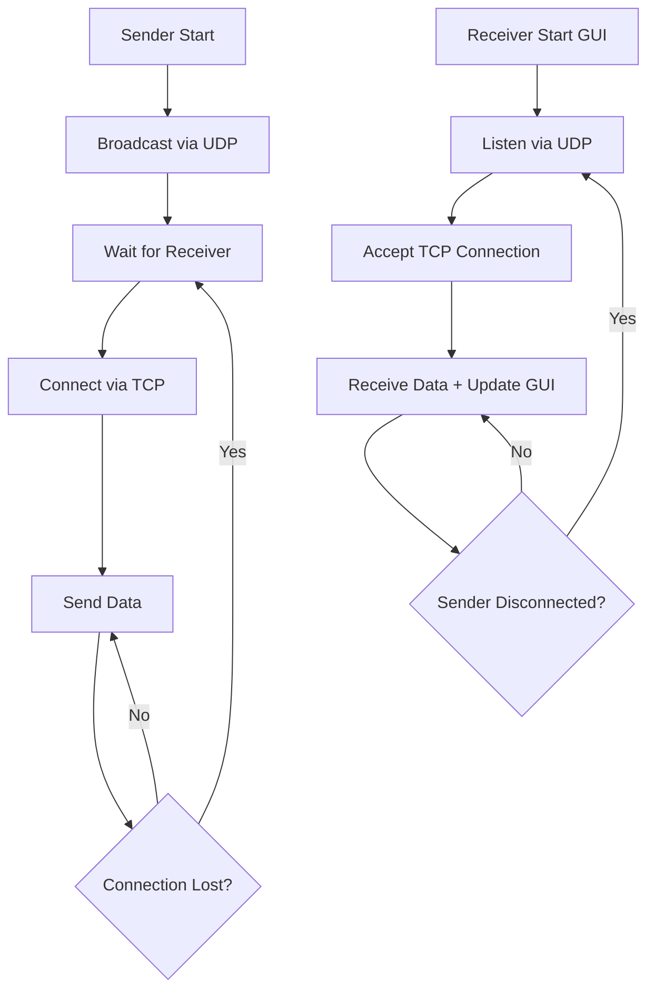

# Sender–Receiver Communication System

This project demonstrates a **basic communication system** where a **Sender** and a **Receiver** exchange messages over a **local network** without using the internet or cloud services.

It works in two steps:
1. **Discovery Phase (UDP):** The Sender broadcasts its availability, and the Receiver listens for it.
2. **Data Transmission Phase (TCP):** Once discovered, the Sender and Receiver establish a TCP connection for reliable communication.

The Receiver has a **self-healing mechanism**: if the connection drops (e.g., sender disconnects or network issue), it automatically goes back to "waiting" mode and reconnects when the Sender is available again.

This makes the system **robust**, **lightweight**, and capable of working even in **isolated local networks** (no internet needed).

---

## 🚀 Features

- **UDP Discovery** → Sender broadcasts, Receiver responds.
- **Reliable TCP Transfer** → Messages delivered safely.
- **Checksum Validation** → Ensures message integrity.
- **Real-Time GUI** → Shows live status (Connected / Disconnected).
- **Auto-Reconnect** → Receiver reconnects without restart.
- **Local Network Only** → Works without internet or cloud.

---

## 🛠️ Technologies Used

- Python 3
- `socket` (for networking)
- `threading` (for concurrent handling)
- `tkinter` (for GUI interface)

---

## 📂 Project Structure

```
project-root/
│── sender.py     # Sender script (UDP broadcast + TCP data send)
│── receiver.py   # Receiver script (UDP listen + TCP receive + GUI)
│── README.md     # Documentation
```

---

## ⚙️ How to Run

1. **Clone the repo:**
   ```bash
   git clone <your-repo-url>
   cd project-root
   ```

2. **Run the Receiver:**
   ```bash
   python receiver.py
   ```

3. **Run the Sender:**
   ```bash
   python sender.py
   ```

👉 Ensure both systems are on the same local network (Wi-Fi/LAN).  
✅ Works even if there is no internet, only local connectivity is required.

---

## 📊 Flow Overview

**Sender Side:**
```
Start → Broadcast via UDP → Wait for Receiver → Connect via TCP → Send Data
```

**Receiver Side:**
```
Start GUI → Listen via UDP → Accept TCP Connection → Receive Data → Update GUI
If connection lost → Return to waiting → Reconnect automatically
```

---

## 💡 Core Idea

The ingenuity of this project lies in making the receiver **self-healing**:
- If the sender disconnects, the receiver goes back to waiting.
- When the sender returns, it reconnects automatically.
- Both sides update the GUI in real-time so the user always knows the connection status.

This ensures **continuous communication** without manual restarts.

---

## 🔄 System Flow Diagram



---

## 📸 Screenshots

### Sender Interface


### Receiver Interface


---

## 📝 Usage Notes

- Both sender and receiver must be on the same local network
- No internet connection required - works in isolated networks
- Receiver GUI provides real-time connection status
- System automatically handles reconnections
- UDP port: Default discovery port
- TCP port: Established dynamically during handshake

---

## 🔧 Customization

You can modify the following parameters in the code:
- UDP broadcast port
- TCP connection timeout
- Message format and checksum algorithm
- GUI appearance and layout
- Auto-reconnect intervals

